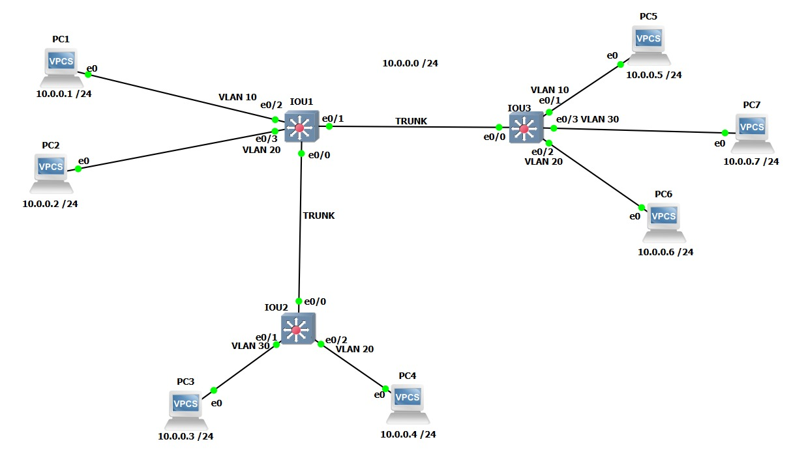

# GNS3 Layer 2 VLAN Trunking Lab

A verified networking lab demonstrating the deployment of Virtual Local Area Networks (VLANs), 802.1Q Trunking Encapsulation, and traffic isolation across a multi-switch local area network backbone. Simulated effectively on GNS3 using IOU (IOS on Unix) switches.

## Topology Diagram

---

## Project Overview
This repository contains a complete Cisco Layer 2 Switch configuration lab implemented in **GNS3**. The project focuses on optimizing broadcast domains, enhancing local network security through strict VLAN segmentation, and ensuring loop-free redundancy using Spanning Tree Protocol.

### Key Technical Concepts Implemented:
* **802.1Q Trunking:** Configured on inter-switch links to allow seamless traffic transport for multiple VLANs across the core switch backbone.
* **VLAN Database Segmentation:** Proper implementation of local VLAN databases (VLAN 10, 20, and 30) ensuring proper switch port mapping.
* **Rapid Spanning Tree Protocol (Rapid-PVST):** Enabled globally to prevent Layer 2 loops and ensure faster convergence across the switching infrastructure.
* **Traffic Isolation & Security:** Verified strict segmentation where hosts within the same VLAN ID communicate successfully, while cross-VLAN traffic is completely blocked without a Layer 3 routing engine.

---

## Network Architecture Details

The entire network infrastructure operates within the major network boundary of **10.0.0.0/24**, demonstrating that Layer 2 barriers (VLANs) successfully isolate traffic even when hosts share the exact same logical IP subnet.

| VLAN ID | Network Purpose / Traffic Group | Assigned IP Range | Affected Hosts |
| :--- | :--- | :--- | :--- |
| **VLAN 10** | Isolated Layer 2 Broadcast Domain 10 | 10.0.0.0/24 | PC1 (`10.0.0.1`), PC5 (`10.0.0.5`) |
| **VLAN 20** | Isolated Layer 2 Broadcast Domain 20 | 10.0.0.0/24 | PC2 (`10.0.0.2`), PC4 (`10.0.0.4`), PC6 (`10.0.0.6`) |
| **VLAN 30** | Isolated Layer 2 Broadcast Domain 30 | 10.0.0.0/24 | PC3 (`10.0.0.3`), PC7 (`10.0.0.7`) |

---

## Verification & Testing (ICMP Diagnostics)
Traffic isolation and trunking states have been fully validated via Cisco IOS CLI and VPCS terminal outputs:
* **Intra-VLAN Reachability (Success):** Continuous ICMP pings between hosts sharing the same VLAN ID (e.g., PC1 to PC5) exhibit 100% success rates, proving stable trunk transportation across switches.
* **Inter-VLAN Isolation (Success):** Pings attempted between different VLAN IDs (e.g., PC1 to PC7, or PC3 to PC6) result in strict `host not reachable` drops, validating absolute Layer 2 traffic containment.

---

## Repository Structure
* `/GNS3-Layer2-Trunking-Lab/Configurations`: Contains the clean, deployment-ready running configurations (`.txt`) for all three switches (`IOU1`, `IOU2`, `IOU3`).
* `/GNS3-Layer2-Trunking-Lab/pings`: Includes the verified host-to-host ICMP ping validation screenshot (`ping-results-and-vlan-isolation.png`).
* `GNS3-Layer2-Trunking-Lab/topology.png`: The network architecture and device interconnection blueprint from GNS3 (displayed above).
* `GNS3-Layer2-Trunking-Lab/show-interfaces-trunk-results.png`: Verified CLI output screenshot displaying operational trunk links and allowed VLANs.

---

## How to Deploy
1. Clone this repository to your local directory.
2. Import the switch configuration files found in the `/GNS3-Layer2-Trunking-Lab/Configurations` folder directly into your GNS3 IOU switch nodes or live Cisco hardware.
